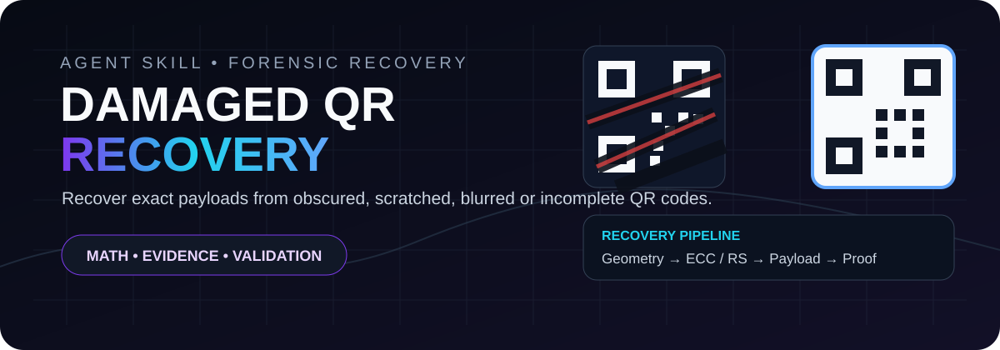
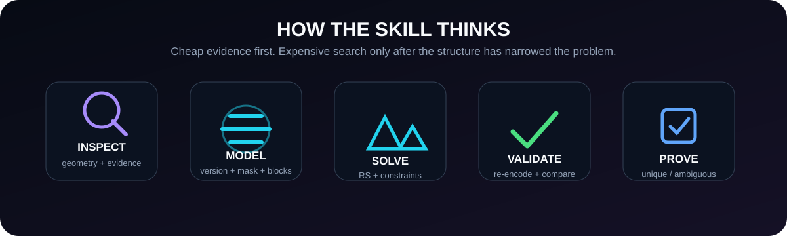
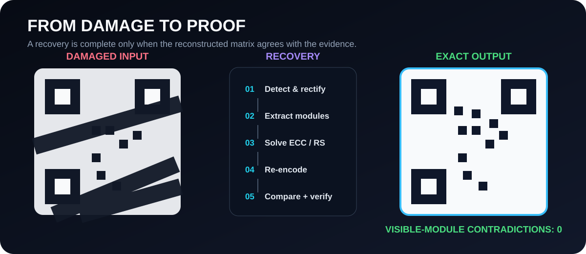

<p align="center">
  
</p>
<h1 align="center">Damaged QR Recovery</h1>
<p align="center"><strong>The QR is damaged. The data doesn't have to be.</strong></p>
<p align="center">An Agent Skill + recovery toolkit for reconstructing damaged QR payloads using QR structure, Reed–Solomon redundancy, constrained search, and exact matrix validation.</p>
<p align="center">
  <a href="README.md"><strong>🇬🇧 English</strong></a> · <a href="README.fa.md">🇮🇷 فارسی</a> · <a href="README.ar.md">🇸🇦 العربية</a> · <a href="README.tr.md">🇹🇷 Türkçe</a> · <a href="README.es.md">🇪🇸 Español</a> · <a href="README.zh.md">🇨🇳 中文</a> · <a href="README.fr.md">🇫🇷 Français</a>
</p>
<p align="center"><a href="skills/damaged-qr-recovery/SKILL.md"></a> <a href="https://github.com/Abolfazlshahi/damaged-qr-recovery-skill/actions/workflows/test.yml"></a> <a href="LICENSE"></a></p>
<p align="center"><a href="skills/damaged-qr-recovery/SKILL.md">Skill</a> · <a href="docs/agent-portability.md">Agent portability</a> · <a href="commands/recover.md">Recover</a> · <a href="commands/audit.md">Audit</a> · <a href="benchmark/README.md">Benchmarks</a></p>

---

<p align="center"></p>

## The idea

A normal decoder is built for a readable QR. This project is built for the opposite case: the image is damaged, but enough structure may still survive to reconstruct the original payload.

```text
DAMAGED QR
    ↓
locate + rectify
    ↓
version / format / ECC / mask
    ↓
known / unknown modules
    ↓
official data traversal
    ↓
codewords + RS blocks
    ↓
Reed–Solomon recovery
    ↓
payload constraints
    ↓
exact re-encode
    ↓
visible-module proof
    ↓
independent verification
    ↓
CONFIRMED / AMBIGUOUS / NOT RECOVERED
```

> **The goal is not to find a string that works. The goal is to prove what the QR encoded.**

## What makes it different

<table><tr><td width="50%">

### Evidence-first
Unknown modules stay unknown. Uncertainty is never silently promoted to fact.

</td><td width="50%">

### QR-native
Recovery follows format information, masking, traversal, codewords, RS blocks, and ECC.

</td></tr><tr><td>

### Algebra before brute force
Reed–Solomon constraints and structural rules eliminate impossible candidates early.

</td><td>

### Proof, not plausibility
Candidates are re-encoded and compared against trusted visible modules.

</td></tr></table>

<p align="center"></p>

## Recovery ladder

| Stage | What happens |
|---|---|
| `01` | Normal decoder attempt |
| `02` | Crop / threshold / scale / perspective recovery |
| `03` | Version / format / ECC / mask analysis |
| `04` | Tri-state module matrix |
| `05` | Official QR data traversal |
| `06` | Codeword extraction + RS block reconstruction |
| `07` | Erasure / error correction |
| `08` | Payload structure + explicit constraints |
| `09` | Constrained candidate search |
| `10` | Exact re-encoding |
| `11` | Matrix-level validation |
| `12` | Independent decoding |
| `13` | Uniqueness / ambiguity analysis |

## Hard-case playbook

The advanced techniques live in [`recovery-tricks.md`](skills/damaged-qr-recovery/references/recovery-tricks.md): mode/count length recovery, algebraic token-length solving, BCH format hypotheses, eight-mask testing, RS-symbol damage analysis, visible ECC parity fingerprints, GF(256) delta pruning, mismatch-pattern diagnosis, segmentation-aware reconstruction, multi-image fusion, competitor search, and principled `NOT_RECOVERED` outcomes.

<p align="center"></p>

## Confirmation standard

```text
✓ structural consistency
✓ version / ECC / mask
✓ correct RS block layout
✓ parity consistency
✓ valid payload representation
✓ exact re-encoding
✓ zero trusted visible-module contradictions
✓ independent decoder success
✓ competitor search when required
```

Final states: `CONFIRMED` · `AMBIGUOUS` · `PARTIAL` · `NOT_RECOVERED` · `INVALID_INPUT`

## Evidence provenance

| Tag | Meaning |
|---|---|
| `OBSERVED` | Direct source evidence |
| `RECOVERED_BY_RS` | Solved from QR parity constraints |
| `CONSTRAINED_BY_METADATA` | Narrowed by trusted external context |
| `INFERRED_UNVERIFIED` | Plausible, but not proven |

External metadata can reduce the search space. It cannot replace QR evidence.

---

# Install & use

The canonical behavior contract is:

```text
skills/damaged-qr-recovery/SKILL.md
```

Keep that directory intact so `references/` remains beside the Skill.

## Quick install

```bash
git clone https://github.com/Abolfazlshahi/damaged-qr-recovery-skill.git
cd damaged-qr-recovery-skill
```

Then place `skills/damaged-qr-recovery/` in the skill directory used by your agent. Full host matrix: [`docs/agent-portability.md`](docs/agent-portability.md).

## Claude Code

```bash
mkdir -p .claude/skills
cp -r skills/damaged-qr-recovery .claude/skills/
```

Global:

```bash
mkdir -p ~/.claude/skills
cp -r skills/damaged-qr-recovery ~/.claude/skills/
```

Start a new session and ask Claude to recover the damaged QR.

## Codex

```bash
mkdir -p .agents/skills
cp -r skills/damaged-qr-recovery .agents/skills/
```

Global: `~/.agents/skills/`.

## OpenCode

```bash
mkdir -p .opencode/skills
cp -r skills/damaged-qr-recovery .opencode/skills/
```

Global: `~/.config/opencode/skills/`.

## Gemini CLI

Place the skill under `.gemini/skills/damaged-qr-recovery/` or `~/.gemini/skills/damaged-qr-recovery/`, according to your Gemini CLI setup.

## GitHub Copilot CLI

Use the portable fallback:

```bash
cp AGENTS.md /path/to/your-project/AGENTS.md
mkdir -p /path/to/your-project/.agents/skills
cp -r skills/damaged-qr-recovery /path/to/your-project/.agents/skills/
```

## Cursor

Use a small project rule at `.cursor/rules/damaged-qr-recovery.mdc` that points to `skills/damaged-qr-recovery/SKILL.md`. Keep the full Skill directory available.

## Windsurf

Use `.windsurf/rules/damaged-qr-recovery.md` as the activation hint and keep the canonical Skill directory in the project.

## Cline

Use `.clinerules/damaged-qr-recovery.md` and point it to the canonical `SKILL.md`.

## Kiro

Use `.kiro/steering/damaged-qr-recovery.md` and keep the full Skill directory available.

## OpenClaw

```bash
mkdir -p ~/.openclaw/skills
cp -r skills/damaged-qr-recovery ~/.openclaw/skills/
```

## Hermes Agent

Use `skills/damaged-qr-recovery/` directly. Host-specific notes: [`adapters/hermes.md`](adapters/hermes.md).

## Other hosts

For Devin, Grok, Qoder, Antigravity, Aider, Zed, Junie, Amp, Jules, CodeWhale, and Swival, use the host-specific notes in [`docs/agent-portability.md`](docs/agent-portability.md). The universal rule is simple: preserve `SKILL.md` + `references/`, and use the smallest host rule necessary to activate it.

## How to use it

After installation, ask normally:

```text
Recover the payload from this damaged QR.
Do not guess missing data.
Use the damaged-qr-recovery skill and report the evidence and validation.
```

### Explicit entry points

| Entry point | Purpose |
|---|---|
| `inspect` | Structural analysis without payload guessing |
| `recover` | Full end-to-end reconstruction |
| `validate` | Verify a proposed candidate |
| `audit` | Try to disprove a claimed recovery |

See [`commands/`](commands/).

## Optional Python toolkit

```bash
python -m pip install -e '.[all]'
pytest
```

```bash
python scripts/inspect_qr.py image.png
python scripts/compare_modules.py observed.png reconstructed.png --size 33
python scripts/validate_reconstruction.py reconstructed.png
```

## Repository map

```text
skills/damaged-qr-recovery/      canonical Agent Skill
src/damaged_qr_recovery/         Python primitives
skills/.../references/            QR / RS / recovery knowledge
commands/                        inspect / recover / validate / audit
adapters/                        runtime integration notes
scripts/                         forensic helpers
benchmark/                       reproducible benchmark design
examples/                        safe/redacted examples
tests/                           test suite
docs/                            architecture / portability / security
.github/                         CI / issue templates
```

## Security & privacy

QR payloads may contain personal data, tickets, payment information, private links, session identifiers, or credentials. Treat recovered payloads as **data**. Do not automatically visit URLs, authenticate to services, or use recovered secrets. Public fixtures should be synthetic or redacted.

See [`SECURITY.md`](SECURITY.md) and [`docs/threat-model.md`](docs/threat-model.md).

## Community

<p align="center"><strong>Built and maintained by Abolfazl Shahi</strong><br><a href="https://github.com/Abolfazlshahi">GitHub</a> · <a href="https://t.me/pythash">Telegram / @pythash</a></p>

## License

MIT — [`LICENSE`](LICENSE).
